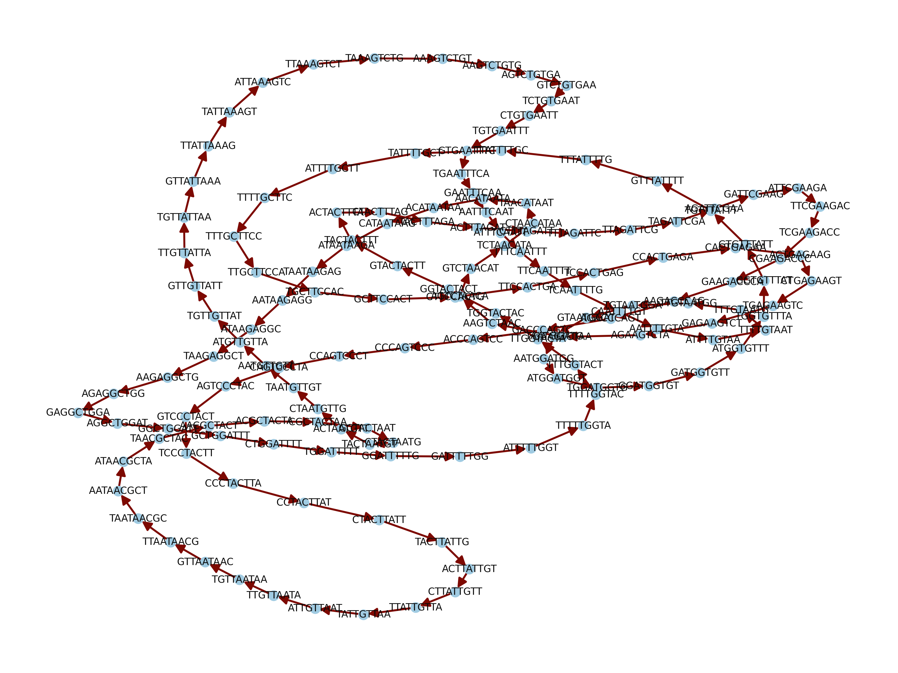
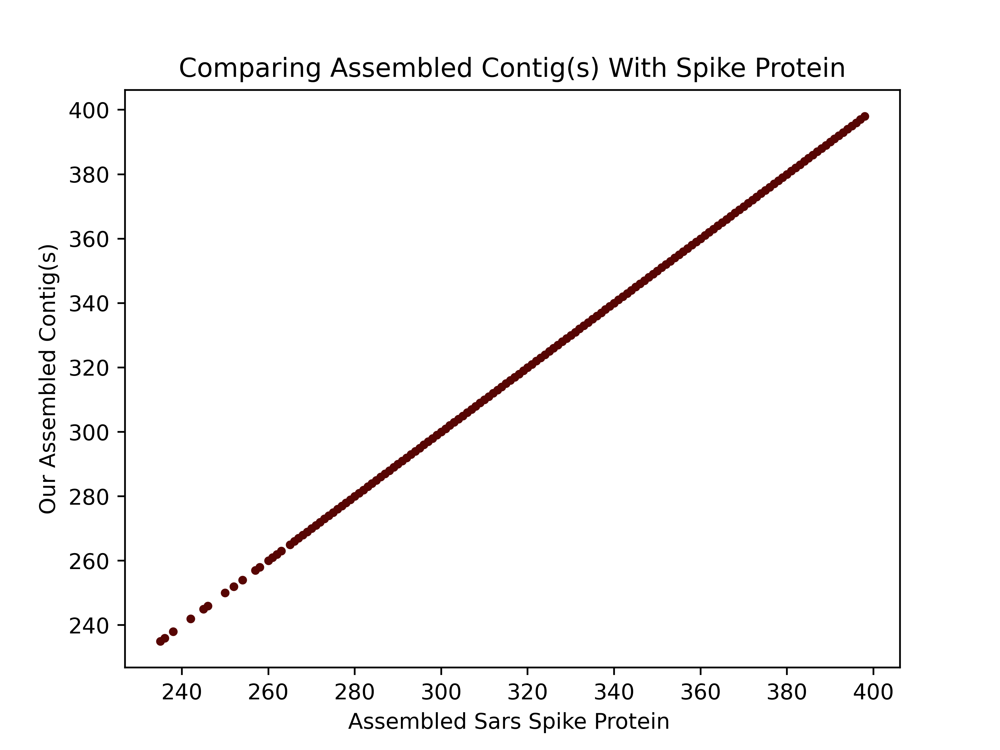

```{cat, engine.opts = list(file = "header.tex")}
\renewcommand{\and}{\\}
```

```{r setup, include=FALSE}
knitr::opts_chunk$set(echo = TRUE)
```
## Abstract
**Coronaviruses possess a highly conserved genomic region encoding for a spike protein. The spike protein has facilitated the understanding of the recently emerged coronavirus disease 2019 (covid19) caused by the severe acute respiratory syndrome coronavirus 2 (SARS-CoV-2) that led to a human pandemic worldwide. Research to understand covid19 has studied the spike protein of SARS-CoV-2 at various multidisciplinary levels in which genetics and genomics have played a major role in untangling the mechanisms underlying the virulence and pathogenicity as well as evolutionary traits of the virus. This study used shotgun sequence reads of the spike protein of SARS-CoV-2 processed through the de Bruijn graph to find an Eulerian path for contig assembly. We identified that contigs of size k-mer (*k*) < 14 were appropriate for assembling the spike protein based on the known reference. Knowledge of the genetic arrangement of the spike protein of SARS-CoV-2 has enhanced the development of vaccines for clinical trials and deployment, and the understanding of the evolution of the virus over space and time for prevention and the generation of new tools for reducing the impact of the disease.**  

## Objective 
Use the de Bruijn graph to find an Eulerian path to assemble contigs and the genome of the SARS-CoV-2 spike protein from shotgun sequencing data.

## Summary of Previous Findings 
SARS-CoV-2 is a single-stranded RNA virus with a spike protein (S) on its outer envelope important for tissue recognition, and attachment. The S, however, is not exclusive to SARS-CoV-2; it is present in all coronaviruses although known to vary in its genetic and structural arrangement ^1^^,^ ^2^^,^ ^3^. 

Assembly of the SARS-CoV-2 genome started with short reads and used `MEGAHIT`, a _de novo_ program that uses succinct de Bruijn graphs, obtaining contigs of size *k*=200 to *k*=30,474 which provided 99.9% genome coverage and evaluated recombination in the S ^4^. Additionally, recent studies assembling SARS-CoV-2 genomes have also used `MEGAHIT` ^5^. Both studies used `Trimmomatic` for trimming before contig assembly.  

Applying the de Bruijn graph is not a direct procedure since inexact repeats and copies generate distortions of the de Bruijn graphs ^6^. Additionally, the method is oftentimes suggested to not be suitable for next or third-generation sequencing approaches ^6^. However, modifications are conducted to work with the method, i.e., Strainline uses a local de Bruijn graph assembly to correct sequencing errors in long reads ^7^. In our work, however, we implement a regular de Bruijn graph to assemble contigs (*k*<14) of the S of SARS-CoV-2 from shotgun reads.  

```{r echo=FALSE, out.width="100%", fig.align ='center', fig.cap="Representation of the de Bruijn graph using k-mer of size 14 and 4 reads. The light blue dots represent the nodes and the red lines are the edges."}
library(knitr)

```

## Results
We used the de Bruijn graph algorithm to assemble contigs from shotgun reads of the S of SARS-CoV-2. We identified that _k_ of size below 14 (we used this because it produces the best comparisons) was more suitable for finding the Eulerian path (Fig. 1). When higher values of _k_ greater than 5 were used, the system we built to create the de Bruijn graph becomes slower. To cope with this, in the program we added progress bars to help judge the completion of the program; however, the image function that creates the directed graph is slow. Upon investigation, it was determined that it takes considerable time (with the latter taking the longest to complete). Using a _k_ of size 14 generated contigs that had an 80-92% (Fig. 2) base pair match when aligned with the reference genome. _k_ of size 6 or smaller produced a match of less than 30%.


```{r echo=FALSE, out.width="100%", fig.align ='center', fig.cap="Dot plot comparison of the spike protein of SARS-CoV-2 assemble using our program in the y-axis and a reference assembly of the spike protein in the x-axis."}
library(knitr)

```

## Conclusion
Our results and program performance indicate that working with a normal de Bruijn graph becomes slower when the size of _k_ is increased. Working with the de Bruijn graph is tedious due to errors and copies which generate distortions of the de Bruijn graphs. For further work, we need to identify a more efficient way of handling repeats and unconnected nodes. Additionally, our program output must be compared to other programs for validation.

## Methods
Raw reads of the SARS-CoV-2 S (Supplementary data 1) were cleaned up using the quality trimmer `Trimmomatic (v.0.39)` with parameters settings: leading: 3, trailing: 3, sliding window: 4:15, minlen: 36, and sequencing errors were corrected using the external program `Lighter` with settings for trimming and discard bad reads with the alpha value of 0.1. Once the sequences were cleaned and trimmed into a list of reads, we created the de Bruijn graph with our program `de_bruijn.py` ^8^^,^ ^9^ using (*k*-1)-mers as nodes, in which an Eulerian path traversed all *k*. For the latter, we implemented the Eulerian algorithms `eulerianCycle.py` to find an Eulerian path/circuit respectively, and to assemble the genome avoiding extra and duplicated edges that could not be traversed we fixed the _k_ size. We aligned at least one assembled contig to the reference S (Supplementary data 2) and assessed the correlation of the coordinates of the assembled location of each base against the known location of each base (Fig. 2). Finally, for whole genome assembly, we tried several values of _k_ and assessed the effect of _k_ in the final assembly. For visualization, we used the `Matplotlib` ^10^ module with `Python (v.3)`.

## Acknowledgments 
All authors contributed equally to this work by participating in the discussion and development of the project. Specific author contributions: S.K. did the `main.py`, `de_bruijn.py`, and `alignment.py`; J.E.S. did the development of the research article and presentation slides; J.D. did `eulerianCycle.py` and `eulerianPath.py`. 

## Data Availability
The programs and methodology used are available online: [github.com/Group21_Final_Project](https://github.com/JonathanDekraker/Group21_Final_Project).  
[_Supplementary data 1_]( https://github.com/JonathanDekraker/Group21_Final_Project/blob/main/input/sars_spike_protein_raw_reads.fastq).  
[_Supplementary data 2_](https://github.com/JonathanDekraker/Group21_Final_Project/blob/main/input/sars_spike_protein_assembled.fna).

## References
\small
1. Wu, C., Yin, W., Jiang, Y. & Xu, H. E. Structure genomics of SARS-CoV-2 and its Omicron variant: drug design templates for COVID-19. _Acta Pharmacol._ Sin. **43**, 3021–3033 (2022).  
2. Cueno, M. E. & Imai, K. Structural Comparison of the SARS CoV 2 Spike Protein Relative to Other Human-Infecting Coronaviruses. _Front. Med._ **7**, (2021).  
3. Moreira, R. A., Guzman, H. V., Boopathi, S., Baker, J. L. & Poma, A. B. Characterization of Structural and Energetic Differences between Conformations of the SARS-CoV-2 Spike Protein. _Mater. Basel Switz._ **13**, 5362 (2020).  
4. Wu, F. et al. A new coronavirus associated with human respiratory disease in China. _Nature_ **579**, 265–269 (2020).  
5. Sah, R. et al. Complete Genome Sequence of a 2019 Novel Coronavirus (SARS-CoV-2) Strain Isolated in Nepal. _Microbiol. Resour. Announc._ **9**, e00169-20 (2020).  
6. Compeau, P. E. C., Pevzner, P. A. & Tesler, G. Why are de Bruijn graphs useful for genome assembly? _Nat. Biotechnol._ **29**, 987 (2011).  
7. Luo, X., Kang, X. & Schönhuth, A. Strainline: full-length de novo viral haplotype reconstruction from noisy long reads. _Genome Biol._ **23**, 29 (2022).  
8. Compeau, P. E. C., Pevzner, P. A. & Tesler, G. How to apply de Bruijn graphs to genome assembly. _Nat. Biotechnol._ **29**, 987–991 (2011).  
9. [Notebook 10.2: De Bruijn graphs.](https://eaton-lab.org/slides/genomics/answers/nb-10.2-de-Bruijn.html)     
10. Caswell, T. A. et al. matplotlib/matplotlib: REL: v3.6.1. (2022) doi:10.5281/ZENODO.7162185. 

------------------------------------------------------  
**Note**: This is not a peer-reviewed journal article.  
The authors were organized in alphabetical order.  
This is a final project for CSCI 5481, Computational Techniques for Genomics. UofM Fall 2022.